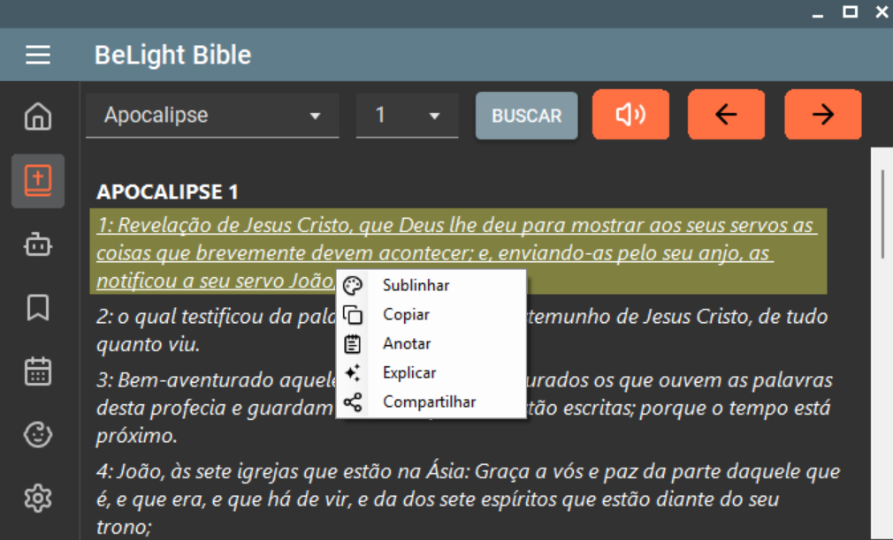

# 📖 BeLight Bible

**BeLight Bible** é uma aplicação de leitura e estudo bíblico moderna, com recursos integrados de inteligência artificial, personalização avançada, leitura com áudio e planos devocionais. Tudo isso com uma experiência fluida e acessível para adultos, jovens e crianças.

---

## ✨ Destaques

- 🕊️ **Versículo do Dia**  
  Receba diariamente um versículo inspirador, com visual limpo e botão para compartilhar.

- 📖 **Leitura Bíblica Completa com Áudio**  
  Leitura organizada por capítulos, com suporte a áudio por versículo. Ao tocar em um versículo, é possível:
  - Copiar
  - Sublinhar
  - Compartilhar
  - Anotar
  - Solicitar explicação com inteligência artificial

- 🤖 **Assistente Virtual com IA (LLM)**  
  Um assistente inteligente integrado que:
  - Oferece explicações espirituais personalizadas

- 📆 **Planos de Leitura Bíblica Personalizados**  
  - Planos criados por administradores (definindo capítulos diários)
  - Barra de progresso para visualização dos avanços
  - Acesso à aba "Meus Planos" para continuar leituras já iniciadas

- 👶 **Bíblia Infantil com Histórias Ilustradas**  
  Um modo especial com linguagem adaptada e ilustrações para crianças.

- ⚙️ **Configurações e Personalização**
  - Tamanho e fonte do texto
  - Tema claro/escuro
  - Manter sessão iniciada
  - Logout rápido

---

## 🛠️ Tecnologias Utilizadas

- 🧠 **Inteligência Artificial:**
  - Modelo ajustado do **LLaMA 3.3**
  - Conexão com o **Groq Cloud**  

- 💻 **Aplicação Desktop:**  
  - C# com Windows Forms
  - Python para text-to-speech (tts)
  - Desenvolvido no Visual Studio 2022

---

## 🔐 Licença

Este projeto está sob uma [licença personalizada](./LICENSE).

> O uso é permitido **exclusivamente para fins educacionais e espirituais**.  
> Uso comercial, redistribuição ou modificação sem autorização são **expressamente proibidos**.  
> Para mais detalhes, consulte o arquivo `LICENSE`.

---

## 🙋‍♂️ Contribuições

Contribuições são bem-vindas!  
Você pode abrir uma [issue](https://github.com/JC-dev9/PSI1623R_JuanLoza_2223223/issues) ou enviar um pull request com melhorias ou sugestões.

---

## 📫 Contato

- 👤 Autor: **Juan Loza**  
- 🔗 GitHub: [@JC-dev9](https://github.com/JC-dev9)

---

> ✨ *“Tua palavra é lâmpada para os meus pés, e luz para o meu caminho.” – Salmos 119:105*
